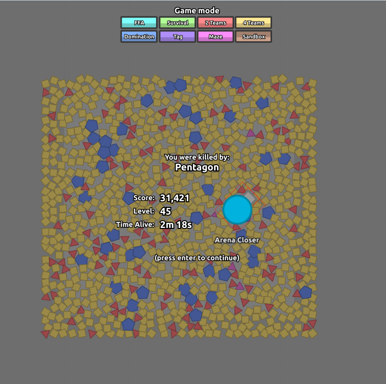

# Diepssect

This a public repo for hacky diep stuff, including networking protocol, WebAssembly, memory editing, & physics.

## Contribution

I started working on this back in the summer of 2017, with the goal of deciphering the diep.io protocol. Unfortunately the developer started updating the game for a while, and each time the memory layout and protocol is shuffled. But since now it's been months since the last update now, I'm starting to work on it again.

If you make any discoveries, pull requests are welcome! You can also message me on my Discord server at [discord.gg/8gvUd3v](https://discordapp.com/invite/8gvUd3v).

## Scripts

All of the userscripts are found in the `userscripts` folder, but you can also install them by just clicking. They all should be able to run in harmony, with the exception of `dpma.js`, which should not be combined with `hexedit.js` or `diep-pl.js`.

https://cx88.github.io/diepssect/dpma/dpma.user.js

- [`dpma.js`](https://cx88.github.io/diepssect/dpma/dpma.user.js) - A WIP script that allows both editing memory and packets.
- [`diep-pl.js`](https://cx88.github.io/diepssect/userscripts/diep-pl.user.js) - A diep packer logger, used for deciphering the protocol.
- [`hexedit.js`](https://cx88.github.io/diepssect/userscripts/hexedit.user.js) - A script that allows memory editing.
- [`injector.js`](https://cx88.github.io/diepssect/userscripts/injector.user.js) - A script that inject itself into diep's `build_*.js` for exporting and replacing variables.
- [`nsfsk.js`](https://cx88.github.io/diepssect/userscripts/nsfsk.user.js) - Test script. Currently does nothing.

There are other browser or node.js scripts, which can be found in the `scripts` folder.

## Protocol

You can get `diep-pl.js` and use it in TemperMonkey. Press F12 to view all short cuts, but it include features like Alt+Z to dump log to console.

The progress in packets are split into 4 categories. Unknown means that the structure of the packet is not yet completely understood. Structured means that the structure of the packet is known, but the specific details are not know yet. Mapped means that the packet is currently completely decoded, but it will change every update and must be mapped again. Done means that the packet has a know and static or extremely predictable mapping, enough to be automated.

### Encodings

Although data is represented in many ways, there are only six primary encodings. You can find information on all of them in the `scripts/coder.js` file.

|   Name   |        Description         | Size |
|----------|----------------------------|------|
| Float    | A floating point number    | 4    |
| Int      | A little-endian integer    | 4    |
| Varint   | A signed 32 bit integer    | 1+   |
| Varuint  | An unsigned 32 bit integer | 1+   |
| Varfloat | A float casted to a varint | 1+   |
| String   | A null terminated string   | 1+   |

Many packets are already completely deciphered. Some packet types have a known structure, but contain tables or mappings that are unknown and possible to figure out through manual trial-and-error. A few are completely unknown and deemed impossible without reverse engineering.

### Serverbound Packets
|  ID  |   Description   |   Status   |
|------|-----------------|------------|
| `00` | init            | Done       |
| `01` | input           | Done       |
| `02` | spawn           | Done       |
| `03` | upgrade build   | Mapped     |
| `04` | upgrade tank    | Mapped     |
| `05` | echo            | Done       |
| `06` |                 | Unknown    |
| `07` | extension found | Structured |
| `08` | clear death     | Done       |
| `09` | take tank       | Done       |
| `0a` | pow result      | Done       |

Serverbound packets are generally easy to dissect, most having few if any arguments. The only exception to this is the `01` packet, which is in the following format: `01 vu(flags) vf(mouseX) vf(mouseY) (vx(movementX) vy(movementY))?`

The flags are as below, starting with the least significant bit:

- left mouse
- up key
- left key
- down key
- right key
- god mode
- suicide
- right mouse
- instant upgrade
- use gamepad
- switch class
- constant of true

Note that the movement arguments are only added when using gamepads.

### Clientbound Packets
|  ID  |    Description    |   Status   |
|------|-------------------|------------|
| `00` | update            | Structured |
| `01` | outdated client   | Done       |
| `02` | compressed update | Structured |
| `03` | message           | Done       |
| `04` | server status     | Done       |
| `05` | echo              | Done       |
| `06` | party link        | Done       |
| `07` | ready             | Done       |
| `08` | achievements      | Structured |
| `09` | invalid link      | Done       |
| `0a` | player count      | Done       |
| `0b` | pow request       | Done       |

Although most clientbound packets are as easy as the serverside packets. There are two main extremely complicated ones, `00` and `02`, which I'll explain in [`CLIENTBOUND.md`](CLIENTBOUND.md).

### Other Repos

Here are some repos about the protocol. Unfortunately, most of the information there especially about the details of the `00` packet is either outdated or incorrect.
- https://github.com/firebolt55439/Diep.io-Protocol
- https://github.com/FlorianCassayre/diep.io-protocol

## WebAssembly

Diep.io uses [Emscripten](https://github.com/kripken/emscripten) with [WebAssembly](https://webassembly.org/). This means that unlike most .io games, diep is written not in JavaScript but rather C++. This means that the code cannot be easily read, and will be difficult to comprehend even when disassembled.

Aside from the generated `bundle_*.js` (formerly `d.js`), diep also have `c.js` (originally [compressed](https://pastebin.com/4Q8vZsUC)) which controls input data.

## Memory editing

You can get `hexedit.js` and use it in TemperMonkey. Six vectors with static memory addresses have been included, and you can find their information in the comments.

## Physics

You can get `diep-pl.js` and use it in TemperMonkey. Press F12 to view all short cuts, but it include features like Alt+X to pause updated, Alt+Q to view motion frame by frame, and Alt+M to enable debug mode which show raw health up to 6 digits.

Although `dpma.js` will replace `diep-pl.js` eventually, currently you can combine both scripts and the entity box should work and display all visible entities. The entity with the highest ID, which is usually the last created entity, will be blue. You'll need to ignore the hidden entities near the center, which are your barrels.

Here's a very useful page with lots of stuff about diep's physics.
- https://spade-squad.com/physics.html
